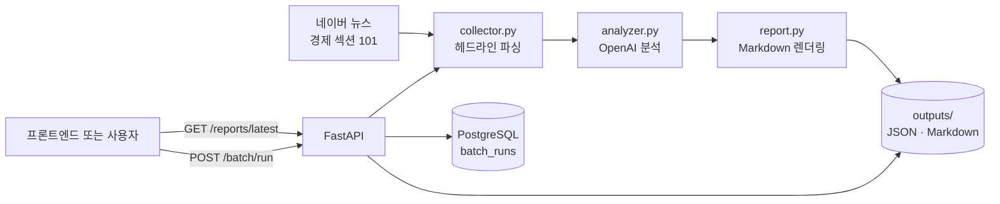

# Financial News Morning Brief MVP — 구현 정리

## 1. 현재 목표와 범위

이 MVP는 **네이버 뉴스 경제 섹션에서 편집된 헤드라인 기사를 수집하고, LLM으로 당일 경제 이슈를 묶어 Markdown 리포트로 생성·조회**하는 로컬 서비스다.

현재 범위는 다음 흐름을 안정적으로 동작시키는 데 맞췄다.

```text
네이버 경제 섹션
  → 헤드라인 10건 수집·정규화
  → OpenAI Structured Outputs로 이슈 추출·요약
  → JSON 원본 + Markdown 리포트 파일 저장
  → FastAPI가 최신 리포트를 프론트엔드에 반환
```

과거 리포트 검색, 사용자별 데이터, 자동 스케줄 실행은 현재 범위에서 제외했다. 다만 Version 1에서 배치 실행 이력을 남기기 위한 PostgreSQL을 추가했다.

## 2. 현재 아키텍처



`POST /batch/run`은 수집부터 저장까지의 배치를 실행하고, `GET /reports/latest`는 파일 시스템에서 가장 최근 Markdown 파일을 읽어 반환한다. 따라서 프론트엔드는 뉴스 수집이나 OpenAI 호출을 직접 수행하지 않는다.

## 3. 구현 완료 항목

| 영역 | 구현 내용 | 주요 파일 |
| --- | --- | --- |
| 뉴스 수집 | 네이버 뉴스 경제 섹션(`section/101`)의 헤드라인 카드에서 기사 10건을 수집 | `app/collector.py` |
| 메타데이터 | 기사 ID, 노출 순서, 제목, 설명문, 언론사, 원문 URL, 관련 뉴스 클러스터 정보를 정규화 | `app/collector.py` |
| 기본 중복 제거 | 한 번의 수집 안에서 URL 기준으로 중복 기사 제거 | `app/collector.py` |
| LLM 분석 | 수집 기사를 이슈별로 묶고 전체 요약과 핵심 이슈 최대 5개 생성 | `app/analyzer.py` |
| 안전한 링크 연결 | LLM에는 기사 ID만 반환하게 하고, 애플리케이션이 ID를 실제 기사 URL로 다시 매핑 | `app/analyzer.py`, `app/report.py` |
| 리포트 저장 | 실행마다 수집 원본 JSON과 Markdown Morning Brief 저장 | `app/main.py` |
| 최신 리포트 조회 | 수정 시각이 가장 최근인 Markdown 파일을 읽어 API 응답으로 반환 | `app/main.py`, `app/api.py` |
| HTTP API | 상태 확인, 배치 실행, 최신 리포트 조회 API 제공 및 Swagger UI 노출 | `app/api.py` |
| 컨테이너 실행 | Dockerfile, Docker Compose, 호스트 `outputs/` 볼륨 구성 | `Dockerfile`, `docker-compose.yaml` |
| 테스트 | 헤드라인 HTML 파싱과 API 주요 응답을 테스트 | `tests/test_collector.py`, `tests/test_api.py` |
| 배치 실행 이력 | 시작·성공·실패 상태와 실행 시간, 결과 파일, 오류 메시지를 저장 | `app/database.py`, `app/batch_runs.py` |

## 4. 수집 설계

### 선택: 경제 섹션 HTML의 헤드라인만 크롤링

수집 URL은 `https://news.naver.com/section/101`이다. 파서는 페이지 전체의 뉴스 링크를 넓게 수집하지 않고, 현재 헤드라인 모듈의 `li._SECTION_HEADLINE` 카드만 선택한다.

이 방식으로 연재, 시세, AiRS 추천 기사처럼 섞일 수 있는 다른 영역을 제외하고, 경제 섹션에서 편집 우선순위가 반영된 헤드라인에 집중한다. 노출 위치(`display_position`)도 함께 저장해 LLM이 편집 우선순위를 참고할 수 있게 했다.

### API 방식 대신 크롤링을 선택한 이유

네이버의 뉴스 검색 API는 질의어 기반 검색 결과를 제공하는 성격이다. 즉, “경제 섹션에 지금 노출된 기사” 또는 “경제 섹션의 편집 헤드라인”을 그대로 반환하는 공식 API로 보기 어렵다. API를 사용하면 `경제`, `금리`, `환율` 등의 검색어를 사전에 정해야 하고, 검색 중복·노이즈가 생기며 헤드라인 편집 순서도 보존되지 않는다.

반대로 크롤링은 이 MVP의 핵심 입력인 **당일 경제 섹션 헤드라인**을 직접 가져올 수 있다. 다만 화면 HTML 구조가 바뀌면 선택자가 깨질 수 있으므로, 샘플 HTML 기반의 파서 테스트를 두고 운영 중에는 수집 실패 감시가 필요하다.

### 본문 대신 제목·설명문을 사용하는 이유

현재 LLM 입력은 기사 본문이 아니라 제목, 설명문(리드문), 언론사, 노출 순서, 관련 기사 수 등이다.

- MVP 단계에서 본문 크롤링은 언론사별 URL·페이지 구조·접근 제한을 추가로 처리해야 한다.
- 10개 이상의 원문을 전달하면 토큰 비용과 처리 시간이 커진다.
- 헤드라인 기반 Morning Brief의 목적에는 빠르게 큰 이슈를 포착하는 것이 우선이다.

이 선택의 한계도 명확하다. 제목과 설명문만으로는 맥락·인과·세부 수치가 부족할 수 있다. 그래서 프롬프트에 입력에 없는 사실, 수치, 전망을 만들지 못하게 제한했다. 정밀한 사실 검증이나 심층 요약이 필요해지면, 다음 단계에서 기사 본문 또는 신뢰 가능한 원문 데이터 소스를 추가해야 한다.

## 5. LLM 분석·리포트 설계

`analyzer.py`는 OpenAI Responses API와 JSON Schema 기반 Structured Outputs를 사용한다. 출력 형식은 아래로 고정한다.

```text
overall_summary
issues[]
  - keyword
  - importance: high | medium | low
  - summary
  - related_article_ids
```

각 요약은 정확히 4개의 완결된 한국어 문장으로 요청한다. 이는 짧은 한두 문장 요약보다 배경과 핵심 내용이 드러나도록 늘린 현재 기준이다. 매수·매도 같은 투자 권유는 금지했다.

특히 관련 기사에는 URL을 직접 생성하도록 하지 않고, 입력으로 준 기사 ID만 반환하도록 했다. 응답 후 유효한 ID인지 다시 검증하고 원본 수집 데이터의 URL을 연결한다. 이 설계는 LLM이 존재하지 않는 링크를 만들거나 다른 기사를 연결할 가능성을 줄인다.

모델명은 소스에 고정하지 않고 `.env`의 `OPENAI_MODEL`로 주입한다. 기본 설정으로는 저비용 분류·요약에 적합한 `gpt-5-nano`를 사용하도록 안내했다. 비용·품질 요구가 달라지면 환경 변수만 바꿔 비교할 수 있다.

## 6. 파일 저장과 API 설계

배치가 성공하면 `outputs/`에 다음 파일이 같은 타임스탬프로 생성된다.

```text
articles_YYYYMMDD_HHMMSS.json
morning_brief_YYYYMMDD_HHMMSS.md
```

JSON에는 당시 LLM에 전달한 수집 기사 메타데이터를 남기고, Markdown에는 사용자가 읽을 리포트를 남긴다. API가 최신 파일을 읽는 방식이므로, UI를 만들더라도 먼저 파일을 직접 해석할 필요가 없다.

제공 API는 다음 세 개다.

| 메서드·경로 | 역할 | 외부 호출 |
| --- | --- | --- |
| `GET /health` | 서버 생존 상태 확인 | 없음 |
| `POST /batch/run` | 수집 → LLM 분석 → 파일 저장 실행 | 네이버, OpenAI |
| `GET /reports/latest` | 가장 최근 리포트 반환 | 없음 |

동기식 크롤러·LLM 호출은 `POST /batch/run`에서 스레드 풀로 실행해 FastAPI 이벤트 루프를 막지 않도록 했다. 실패 시에는 내부 예외 세부사항 대신 `502`와 일반적인 실패 메시지를 반환한다.

## 7. Version 1: 배치 실행 이력

리포트 저장소로서 DB를 도입하지는 않았다. 대신 운영 이력 전용으로 PostgreSQL의 `batch_runs` 테이블을 추가했다.

```text
POST /batch/run
→ batch_runs에 running 생성
→ 뉴스 수집 · LLM 분석 · 파일 저장
→ success: 종료 시각, 실행 시간, 기사 수, 출력 파일명 기록
→ failed: 종료 시각, 실행 시간, 오류 메시지 기록
```

테이블은 `id`, `status`, `started_at`, `finished_at`, `duration_seconds`, `article_count`, `articles_file`, `report_file`, `error_message`를 저장한다. 기존 `POST /batch/run` 응답에는 생성한 `batch_run_id`도 포함된다.

실행 이력 조회 API도 구현했다. `GET /batch-runs`는 최신순 목록을, `GET /batch-runs/{id}`는 상세 이력을 반환한다. 배치 로그는 표준 출력에 `시간 | 레벨 | 모듈 | event=... key=value` 형식으로 남긴다. 실행 ID를 모든 배치 이벤트에 포함해 Docker 로그와 DB 이력을 연결할 수 있다.

## 8. 리포트 저장에 DB를 두지 않은 이유

초기 계획에는 PostgreSQL과 과거 리포트 API도 있었지만, 현재 요구에는 “최신 리포트 생성과 조회”가 핵심이다. 이 상태에서 DB를 도입하면 스키마 설계, 마이그레이션, 컨테이너 운영, 백업 등 구현·운영 부담이 생기지만 사용자 가치가 크게 늘지 않는다.

그래서 현재는 로컬 파일 시스템을 경량 저장소로 사용한다.

```text
배치 실행 → outputs/에 파일 저장 → API가 최신 Markdown 읽기 → 프론트엔드에 JSON 반환
```

이 선택은 단일 로컬 인스턴스에는 적합하지만, 여러 서버 인스턴스·여러 사용자·기간별 검색·통계가 필요해지면 한계가 있다. 그때 PostgreSQL(메타데이터·검색)과 오브젝트 스토리지(리포트 원문) 도입을 검토한다.

## 9. Docker 구성과 근거

`Dockerfile`은 Python 3.12 slim 이미지에 의존성을 설치하고 FastAPI를 `uvicorn`으로 8000 포트에서 실행한다. 애플리케이션 코드는 이미지에 복사하므로 코드 변경 뒤에는 재빌드가 필요하다.

`docker-compose.yaml`은 API와 PostgreSQL 컨테이너로 구성되어 있다.

- DB 이름·계정·비밀번호는 `.env`에서 한 번만 읽으며, `.env`는 이미지에 복사하지 않고 컨테이너 실행 시 환경 변수로만 전달한다. API는 Docker 내부 네트워크의 `db` 서비스명으로 연결한다.
- `./outputs:/app/outputs` 바인드 마운트로 생성 리포트를 로컬에 보존한다.
- 컨테이너 재시작 후에도 기존 리포트를 조회할 수 있다.
- `restart: unless-stopped`로 Docker가 재시작되어도 API가 다시 올라오도록 했다.
- PostgreSQL은 named volume `postgres_data`에 데이터를 보존하며, API는 DB health check 성공 뒤에 시작한다.

`.dockerignore`는 `.env`, Git 이력, 로컬 가상환경, 캐시, 생성 리포트 등을 빌드 컨텍스트에서 제외한다. API 키가 이미지 레이어에 들어가는 일을 막고, 이미지 빌드에 불필요한 파일을 줄이기 위한 설정이다.

## 10. 검증 현황

- 샘플 HTML을 이용해 헤드라인 카드, 기사 메타데이터, URL 중복 제거를 검증하는 테스트가 있다.
- FastAPI의 상태 확인, 배치 실행 응답, 최신 리포트 반환, 리포트 없음 `404`를 검증하는 테스트가 있다.
- 파서, API, 배치 성공·실패 상태 기록을 포함한 테스트 7건이 통과했다.
- 구현 과정에서 실제 헤드라인 10건 수집과 OpenAI 기반 Markdown 생성도 확인했다.
- Docker Compose로 API를 실행한 뒤 `GET /health`, `GET /reports/latest` 응답도 확인했다.

실행 방법과 API 호출 예시는 [README](../README.md)에 정리되어 있다. 현재 실행 환경은 Docker Compose를 기준으로 한다.

## 11. 현재 한계와 다음 우선순위

### 현재 한계

- 네이버 화면 구조가 바뀌면 CSS 선택자가 동작하지 않을 수 있다.
- 한 번의 실행 안에서는 URL 중복을 제거하지만, 실행 날짜를 넘는 중복 관리에는 아직 대응하지 않는다.
- 기사 본문을 읽지 않으므로 사실 관계와 세부 맥락은 리드문 수준에 제한된다.
- `POST /batch/run`은 오래 걸릴 수 있고, 동시 요청을 하나로 묶는 잠금·작업 큐는 아직 없다.
- 로그는 Docker 표준 출력에 남기며, 파일 회전이나 중앙 로그 저장소 연동은 아직 없다.
- 최신 리포트만 조회하며, 날짜별·과거 리포트 목록 API는 없다.
- 로컬 파일 저장소는 단일 인스턴스에 적합하며 다중 인스턴스 배포에는 공유 스토리지가 필요하다.

### 다음 단계 제안

1. 수집 실패를 분류하고 재시도·로그를 추가한다.
2. 실제 페이지 변화에 대비해 파서 fixture와 회귀 테스트를 보강한다.
3. 배치 중복 실행 방지와 작업 상태 조회를 추가한다.
4. 프론트엔드 연동 시 CORS 설정과 리포트 화면을 추가한다.
5. 정해진 시간에 실행할 필요가 생기면 스케줄러를 추가한다.
6. 과거 조회·검색·다중 사용자 요구가 생길 때 DB와 공유 저장소를 도입한다.
